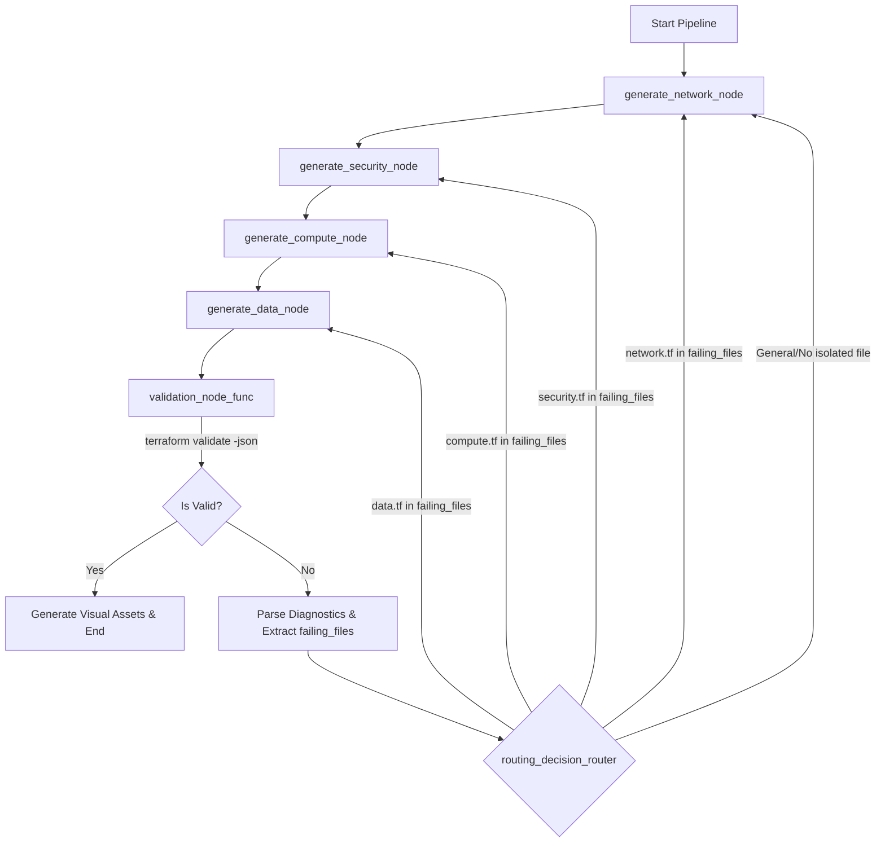

# Detailed Implementation Analysis: Localized Graph Routing, Contextual RAG & Prompt-Driven Reflection

This document details the architectural changes made to transition the Terraform Agentic Engine from a brittle loopback architecture into a rock-solid, target-scoped self-healing validation pipeline. 

The implementation was executed in three phases to isolate failures, prevent syntax errors proactively using documentation-backed RAG, and steer the LLM towards precise corrections using structured reflection context.

---

## Architecture Overview

---

## Phase 1: Localized Graph Routing (Immediate Fix)

### Objective
Instead of resetting the entire generation pipeline and routing back to the initial network phase whenever any validation error occurred, the system now targets the specific domain-scoped files that generated compiling errors.

### Implementation Details
1. **State Modifications**:
   - Extended `GraphState` in [state.py](file:///d:/proj_1/upwork/tf%20agent/tf-agentic-engine/src/state.py) to include `failing_files: List[str]`. This maintains a record of which specific files failed compilation.
   - Initialized `failing_files` to `[]` in `create_initial_state`.
   
2. **Diagnostics Parser**:
   - Refactored `execute_terraform_validation` in [utils.py](file:///d:/proj_1/upwork/tf%20agent/tf-agentic-engine/src/utils.py) to parse the JSON output of `terraform validate -json`.
   - Iterates through the diagnostics array, retrieves `range.filename` for each error severity diagnostic, extracts the base filename (e.g., `compute.tf`), and returns them in a unique list.
   - Added a fallback regex scanner on stderr in case the JSON decoder fails, extracting mentions of standard workspace filenames.

3. **Hierarchical Graph Router**:
   - Updated the conditional router `routing_decision_router` in [nodes.py](file:///d:/proj_1/upwork/tf%20agent/tf-agentic-engine/src/nodes.py) to evaluate `failing_files` and return routes prioritized by architectural hierarchy:
     1. If `network.tf` has errors, route to `fix_network`.
     2. If `security.tf` has errors, route to `fix_security`.
     3. If `compute.tf` has errors, route to `fix_compute`.
     4. If `data.tf` has errors, route to `fix_data`.
     5. If multiple files fail, it handles the upstream dependency first to avoid cascading downstream changes.
     6. If no specific files are identified, fallback to a full loopback starting at `fix_network`.

---

## Phase 2: Structural Ingestion of Contextual RAG (Proactive Prevention)

### Objective
Inject official up-to-date Terraform provider schemas directly into the generation context to prevent the LLM from generating outdated, deprecated arguments (e.g., legacy pre-v4 inline S3 configurations or RDS subnet structures).

### Implementation Details
1. **Lightweight Cosine Similarity Vector DB**:
   - Built a local vector database wrapper `LocalVectorDB` inside [vector_db.py](file:///d:/proj_1/upwork/tf%20agent/tf-agentic-engine/src/vector_db.py).
   - Seeded it with official and modern schemas for `aws_s3_bucket`, `aws_db_instance`, `aws_dynamodb_table`, `aws_db_subnet_group`, `aws_sqs_queue`, and `aws_lambda_function`.
   - Uses term frequency vector tokenization and cosine similarity matching to return the exact template matching query strings.

2. **Ingestion Layer**:
   - Modified `generate_data_node` in [nodes.py](file:///d:/proj_1/upwork/tf%20agent/tf-agentic-engine/src/nodes.py) to extract the resource type of each data telemetry resource.
   - Queries `LocalVectorDB` for each resource type and injects matching templates directly inside the prompt context under the directive:
     > [!IMPORTANT]
     > CRITICAL: You must model your block layout explicitly against this schema template. The parameters listed inside are the only valid arguments allowed by the provider compiler.

---

## Phase 3: The Prompt-Driven Reflection Loop

### Objective
Provide action-oriented reflection context during retry loops instead of feeding raw compiler stack traces, enabling the LLM to locate and correct syntax errors rather than repeating them.

### Implementation Details
1. **Reflection Context Generator**:
   - Created `generate_reflection_context(failing_file: str, raw_errors: str) -> str` in [utils.py](file:///d:/proj_1/upwork/tf%20agent/tf-agentic-engine/src/utils.py).
   - Formats the compiler feedback, noting the target failing file, compiler diagnostics, and targeted instructions instructing the LLM to rewrite only the erroneous code blocks while retaining structural references intact.

2. **Integration into Nodes**:
   - Integrated `generate_reflection_context` into the validation failure loopback paths of `generate_network_node`, `generate_security_node`, `generate_compute_node`, and `generate_data_node` in [nodes.py](file:///d:/proj_1/upwork/tf%20agent/tf-agentic-engine/src/nodes.py).
   - During a retry pass, the generation nodes swap the default mode prompt with the reflection context and previous generated code to focus the model's rewrite exclusively on resolving syntax errors.

---

## Verification & Test Coverage

The following tests were introduced to verify pipeline reliability:
1. **Localized Routing Tests** [test_localized_routing.py](file:///d:/proj_1/upwork/tf%20agent/tf-agentic-engine/tests/test_localized_routing.py):
   - `test_routing_decision_router_priority`: Verifies that `network.tf` takes priority over downstream errors.
   - `test_routing_decision_router_hierarchical`: Verifies correct hierarchical ordering of other failures.
   - `test_routing_decision_router_max_retries_exit`: Ensures the agent exits gracefully when max retries are exceeded.
2. **Vector DB Tests** [test_vector_db.py](file:///d:/proj_1/upwork/tf%20agent/tf-agentic-engine/tests/test_vector_db.py):
   - `test_vector_db_query`: Verifies that searching for a resource type retrieves the matching schema template.
   - `test_vector_db_query_miss`: Verifies threshold filtering for unrelated queries.
3. **Reflection Loop Tests** [test_reflection_loop.py](file:///d:/proj_1/upwork/tf%20agent/tf-agentic-engine/tests/test_reflection_loop.py):
   - `test_generate_reflection_context`: Asserts that `generate_reflection_context` structures files and errors correctly.
