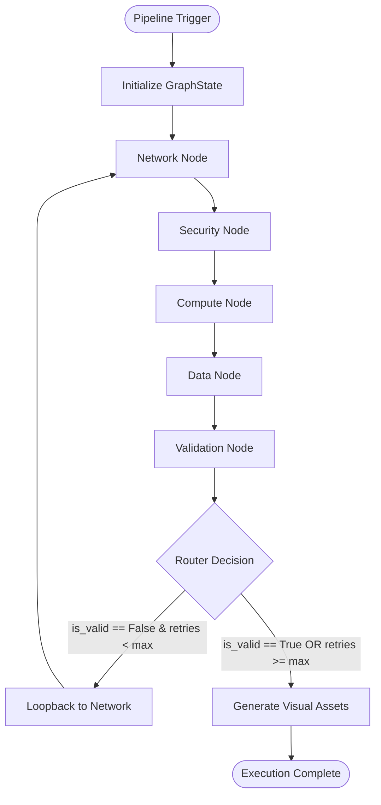

# Technical Documentation: TF-Agentic-Engine

Welcome to the in-depth technical reference for the **TF-Agentic-Engine**. This document details the architectural design, control flow, internal state models, operational modes, and runtime self-healing mechanisms of the system.

---

## 1. System Architecture & Component Design

The TF-Agentic-Engine is designed as an autonomous, multi-agent pipeline using **LangGraph** to coordinate LLM-based generation phases and a deterministic Terraform validation-healing loop.



### Directory Structure & Layout
* **[main.py](file:///d:/proj_1/upwork/tf%20agent/tf-agentic-engine/main.py)**: Orchestrator entry point. Initializes settings, manages conditional environment scanning (local mock vs. live AWS), and boots up the LangGraph execution.
* **[src/agent.py](file:///d:/proj_1/upwork/tf%20agent/tf-agentic-engine/src/agent.py)**: Configures the state graph (`StateGraph`), registers functional nodes, maps linear transitions, and defines conditional edge routing.
* **[src/state.py](file:///d:/proj_1/upwork/tf%20agent/tf-agentic-engine/src/state.py)**: Defines the structured `GraphState` typed dictionary representing the system's runtime memory.
* **[src/nodes.py](file:///d:/proj_1/upwork/tf%20agent/tf-agentic-engine/src/nodes.py)**: Core generators (`generate_network_node`, `generate_security_node`, `generate_compute_node`, `generate_data_node`) and validation/routing nodes.
* **[src/utils.py](file:///d:/proj_1/upwork/tf%20agent/tf-agentic-engine/src/utils.py)**: Contains LLM connection wrappers, token parsing regexes, HCL compliant formatters/scrubbers, post-processing correctors, and structural graph rendering functions.
* **[config/settings.py](file:///d:/proj_1/upwork/tf%20agent/tf-agentic-engine/config/settings.py)**: Holds configuration values such as model tags, context sizes, and retry counts.
* **[scanner/discovery.py](file:///d:/proj_1/upwork/tf%20agent/tf-agentic-engine/scanner/discovery.py)**: Discovers or mock-simulates configurations.

---

## 2. State Management (`GraphState`)

The workflow communicates via a centralized dictionary structure called `GraphState`. This object accumulates generated code, records errors, and carries topology metadata across execution nodes:

```python
class InfrastructureGraph(TypedDict):
    nodes: Dict[str, Any]       # Key: Resource ID (e.g., 'aws_vpc.main'), Value: Attributes
    edges: List[Dict[str, Any]] # List containing 'source', 'target', and dependency 'relation' type

class GraphState(TypedDict):
    deployment_mode: str        # Mode constraint: "new", "import", "clone"
    user_prompt: str            # Original user instruction (only read in 'new' mode)
    aws_input_data: Dict[str, Any] # Telemetry JSON scanned from existing environment
    retry_count: int            # Active iteration count of the healing cycle
    max_retries: int            # Upper threshold for fixing validation errors
    current_phase: str          # Track active generation phase: network | security | compute | data
    network_hcl: str            # Generated VPCs, subnets, route tables
    security_hcl: str           # Generated IAM policies, security groups, ACLs
    compute_hcl: str            # Generated EC2 instances, Autoscaling profiles
    data_hcl: str               # Generated S3 buckets, RDS Instances, DB subnet groups
    validation_results: str     # Raw parser errors returned from compilers
    is_valid: bool              # Validation status of output configuration
    infrastructure_graph: InfrastructureGraph # Extracted dependency relationships
    compliance_report: List[Any] # Linting or rule check warnings
```

---

## 3. Operational Modes

The engine dynamically mutates its prompt constraints and system personas based on the runtime `mode` parameter:

| Operational Mode | Objective | Context/Variable Constraints | ID Naming Source |
| :--- | :--- | :--- | :--- |
| **`new`** | Greenfield architecture synthesis. | Variable assignments forbidden (`var.*` references stripped). All CIDRs and settings are hardcoded. | Uses standardized names like `aws_vpc.main`, `aws_security_group.main`. |
| **`import`** | Map existing telemetry to HCL. | Variables completely forbidden. Uses strict string literals. Outputs Terraform 1.5+ `import` blocks. | Directly extracts IDs (e.g. `vpc-xxxx`, `subnet-xxxx`) from input JSON data. |
| **`clone`** | Parameterize existing architecture. | Replaces hardcoded configuration values with dynamic `var.*` references and appends variable defaults. | Parametric keys mapped from scanned resources to support replication. |

---

## 4. LangGraph Workflow & Node Mechanics

### 1. `generate_network` ([generate_network_node](file:///d:/proj_1/upwork/tf%20agent/tf-agentic-engine/src/nodes.py#L43))
Generates `network.tf`. Translates scanned VPC and Subnet configurations into Terraform. It filters out non-network elements to avoid polluting the context window.
* **Constraints**: ONLY VPCs, Subnets, Internet Gateways, NAT Gateways, Route Tables, and Route Table Associations. No security groups or compute assets are allowed.

### 2. `generate_security` ([generate_security_node](file:///d:/proj_1/upwork/tf%20agent/tf-agentic-engine/src/nodes.py#L247))
Generates `security.tf`. Analyzes the output of the network node and injects firewall resources, IAM policies, and VPC endpoints.
* **Constraints**: Security groups, rules, IAM Roles, IAM Policies. It must reference the VPC created in the previous node using dynamic referencing (`aws_vpc.main.id`) instead of static string replacements.

### 3. `generate_compute` ([generate_compute_node](file:///d:/proj_1/upwork/tf%20agent/tf-agentic-engine/src/nodes.py#L442))
Generates `compute.tf`. Translates virtual servers, launch patterns, and autoscaling constructs.
* **Constraints**: References public/private subnets and security groups from preceding phases.

### 4. `generate_data` ([generate_data_node](file:///d:/proj_1/upwork/tf%20agent/tf-agentic-engine/src/nodes.py#L639))
Generates `data.tf`. Manages database services (RDS, DynamoDB) and storage options (S3).
* **Constraints**: Ensures relational databases are tied to DB Subnet Groups mapping back to private subnets.

### 5. `validate_code` ([validation_node_func](file:///d:/proj_1/upwork/tf%20agent/tf-agentic-engine/src/nodes.py#L837))
Runs local verification checks against the generated HCL code inside the `terraform_workspace/` directory:
1. Generates a local mock provider block (`provider.tf`) overriding API credentials checks.
2. Executes subprocess commands `terraform fmt` and `terraform init -backend=false`.
3. Runs a deep semantic validation check: `terraform validate -json`.
4. If errors are found, parses and normalizes the compiler output.
5. Updates `validation_results` in the `GraphState` and increments `retry_count`.

---

## 5. Self-Healing & HCL Firewalls

A critical feature of the engine is the automated runtime correction system, which executes regex patches and structural fixes on generated code to prevent compiler failure loops:

### S3 Provider V5 Deprecation Scrubber
Modern Terraform AWS Provider versions (v5.x+) deprecated several parameters from the root `aws_s3_bucket` block. The parser parses lines inside `aws_s3_bucket` declarations and strips:
* `versioning { ... }`
* `server_side_encryption_configuration { ... }`
* `acl = "..."`

It automatically generates separate standalone resource blocks (`aws_s3_bucket_versioning`, `aws_s3_bucket_server_side_encryption_configuration`) to ensure validation succeeds.

### RDS Subnet Group Corrector
If the LLM inserts `subnet_ids` directly inside an `aws_db_instance` block (a common syntax hallucination), the corrector intercepts the structure:
1. Strips the `subnet_ids` attribute from the database instance block.
2. Dynamically generates an `aws_db_subnet_group` resource linking the specified subnets.
3. Points the `aws_db_instance` to the newly generated group using `db_subnet_group_name`.

### Autoscaling Group Tag Corrector
Terraform's `aws_autoscaling_group` does not accept raw `tags = [...]` or `tags_all = ...` attributes. The compliance engine parses ASG blocks, extracts any mapped tag structures, and converts them to individual `tag { key = "...", value = "...", propagate_at_launch = true }` sub-blocks.

### Security Group Ingress/Egress Block Corrector
Secures block assignments by fixing standard syntax errors. It converts bracketed list mappings `ingress = [{...}]` to explicit repeating blocks:
```terraform
# Hallucinated list structure (Invalid)
ingress = [{
  from_port = 80
  to_port = 80
  protocol = "tcp"
}]

# Fixed repeating block structure (Valid)
ingress {
  from_port   = 80
  to_port     = 80
  protocol    = "tcp"
  cidr_blocks = ["0.0.0.0/0"]
}
```
If rules are entirely empty or missing required attributes, default safe ingress/egress rules are dynamically inserted. Additionally, the Security prompt enforces standard HCL block syntax at the model level, banning JSON arrays, trailing brackets (e.g. `ingress]`), and ensuring tag blocks are nested inside the resource.

### Resource Identifier Hyphen Corrector
Converts resource local block names containing hyphens (`-`) into underscores (`_`) to conform to HCL labelling guidelines (e.g. `resource "aws_s3_bucket" "prod-data"` -> `resource "aws_s3_bucket" "prod_data"`), while keeping hyphens inside actual name/identifier fields matching live AWS.

### Import Block Syntax Scrubber
Dynamically strips double quotes from target identifiers in the `to` argument of `import` blocks (e.g., converting `to = "aws_instance.my_ec2"` to `to = aws_instance.my_ec2`), enforcing Terraform's requirement for static, unquoted resource references.

### DynamoDB Root Argument Scrubber
Intercepts and automatically removes invalid, hallucinated root-level arguments like `attribute_name` and `key_type` from generated DynamoDB table resources to prevent compiler crashes.


### Variable Consolidation & Resource Deduplication
* **`consolidate_terraform_variables`**: Aggressively scans all phase files, extracts variable definitions via brace matching, deduplicates them, and writes them cleanly to a centralized `variables.tf` while deleting them from the source files.
* **`deduplicate_resources`**: Scans files in execution dependency order (`network` -> `security` -> `compute` -> `data`) and filters out any duplicate resource definitions of the same type and local name.

### Token Template Shielding
To prevent template rendering exceptions in LangChain when passing raw error logs containing JSON brackets (`{}`), the orchestrator runs:
```python
escaped_errors = state.get("validation_results", "").replace("{", "{{").replace("}", "}}")
```
This protects the prompt template compilers from throwing formatting errors.

---

## 6. Telemetry Ingestion

The system ingests environment telemetry through two core discovery vectors defined in `aws_client.py`:

* **`fetch_live_infrastructure`**: Scans a running AWS account using `boto3`. Discovers active VPC topologies, subnet mappings, running EC2 nodes, database instances, security group configurations, DynamoDB schemas, and S3 targets.
* **`test_fetcher_locally`**: Uses `moto` (an offline AWS simulation library) to mock AWS API endpoints locally. This allows for safe, offline integration testing without querying actual cloud endpoints.

---

## 7. Visual Diagram Generation

Upon passing HCL validation (`is_valid == True`), the pipeline automatically exports documentation assets:

1. **PNG Topology Map**: Converts generated infrastructure configurations into Graphviz DOT syntax. Color-codes resources by tier (VPC, security boundary, network tier, data engine) and compiles it into `architecture.png`.
2. **Draw.io XML Layout**: Writes an structured XML schematic (`architecture.drawio`) containing shapes, connectors, and layered layouts. This document can be imported directly into Draw.io for manual edits.
